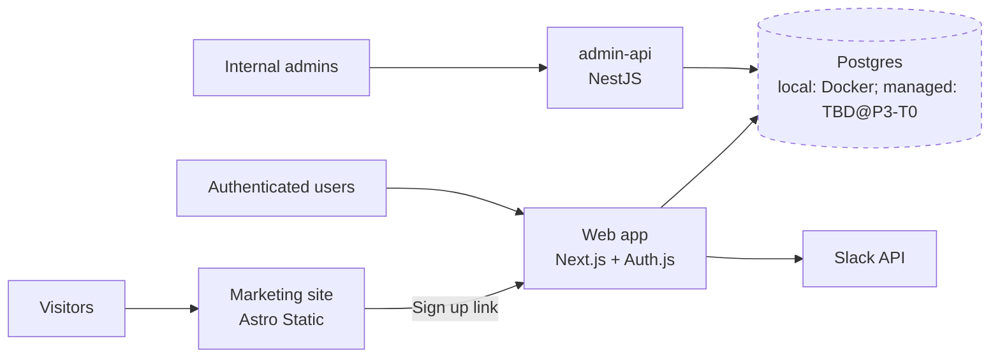

# Example: a fully-initialized solution

Last Updated: 2026-05-21

This document shows what an `ai-starter`-based **solution** looks
like after running the new-solution wizard once (creates the
solution + the first project) and then add-project mode once more
(adds a second project). It's a teaching reference — not a real
project — using a hypothetical task-tracking SaaS called
**TaskTrack** as the example.

The fragments below are excerpts, not full files.

> **Versions, dates, and source URLs in this example are
> illustrative only.** The recipes use placeholder patterns
> (`<X.Y.Z>`, `<YYYY-MM-DD>`); the real INIT verifies live versions
> from canonical sources per the Versioning Rules in
> `/ai/AI_RULES.md`. Don't copy these pins into a real project.

---

## The story this example tells

Day 1: Tommy runs `KICKOFF_NEW_SOLUTION.md`. Picks Web → TypeScript
→ Next.js Web App. Describes the feature loop. Generates an INIT
prompt. Pastes it. Now there's a solution with `projects/web/`.

Day 30: Phase 1 done, Phase 2 underway, app works locally. Tommy
realizes the next thing is a small Astro marketing site that links
to the web app. Runs `KICKOFF_ADD_PROJECT.md`. Picks Web →
TypeScript → Astro Static. Names it `marketing`. Says it doesn't
talk to any existing project (visitors land on it; the only path
to `web` is via a "Sign up" link). Generates an ADD_PROJECT prompt.
Pastes it. Now `projects/marketing/` exists alongside
`projects/web/`.

Day 60: Tommy needs an internal admin tool. Runs add-project mode
again. Picks Server → TypeScript → NestJS API. Names it
`admin-api`. Says it talks to `web` (admin tool shares user data).
Now three projects in one solution.

---

## `/ai/SOLUTION.md` after the second project lands (excerpt)

```markdown
# Solution

Last Updated: <YYYY-MM-DD>

## Solution Name
TaskTrack

## Application Description
A team task-tracking SaaS for small engineering teams (2-15
people). Web app with email + magic-link auth, project boards,
task assignments, due dates, Slack notifications. The solution
also includes a marketing site that drives signups and (Day 60+)
an admin API for internal operations.

## Target Users
Engineering team leads at small startups (Seed / Series A).

## Primary Goals
- Sub-2-second time-to-first-board on a fresh signup.
- Keep monthly hosting cost under $200 at 100 active teams.

## Explicit Non-Goals
- Mobile app (web-responsive only).
- Per-user permissions inside a project (project-level enough).
- Real-time collaboration (live cursors, etc.).

---

## Projects

| Name       | Platform  | Language   | Template            | Status   |
|------------|-----------|------------|---------------------|----------|
| web        | Web       | TypeScript | Next.js Web App     | Phase 2  |
| marketing  | Web       | TypeScript | Astro Static        | Phase 2  |
| admin-api  | Server    | TypeScript | NestJS API          | Phase 1  |

## Tier

Small team / early production. CI present, deploys to managed
hosting, multiple contributors expected. Trigger to flip to
production: first paying customer + multi-region requirement.

## Rules in force

- Always applicable: Git, Planning-File Hygiene, Versioning,
  Security, Destructive Operations, Reasoning Checkpoint,
  Local-First Development, Blocked Escalation, Task Quality,
  General / Coding / Review / Handoff.
- **Infrastructure & Hosting Rules**: applicable but **deferred
  to P3-T0** (the solution is in Phase 2; deploy planning fires
  end-of-Phase-2 / Phase-3).
- **Cost Rules**: Free-tier ceilings captured; Cost-Rules-
  compliant cap deferred to P3-T0.
- ADR overrides: none.
```

---

## `/ai/ARCHITECTURE.md` System Overview (after Day 60)



The cloud subgraph is dashed and labeled "TBD@P3-T0" because the
solution is still in Phase 2; the managed Postgres instance ADR
gets written at P3-T0.

---

## `/ai/DECISIONS.md` after Day 60 (excerpts)

```markdown
## ADR-001: TypeScript <X.Y.Z>
Date: <YYYY-MM-DD>
Status: Accepted
Project: solution

### Decision
Use TypeScript <X.Y.Z> (current stable, verified at
https://www.npmjs.com/package/typescript on <YYYY-MM-DD>) as the
solution-default language. Individual projects may deviate
(Python / Go / C# / etc.) with their own ADR.

### Reason
First project is Next.js Web App (TS). Marketing site is Astro
(TS). admin-api is NestJS (TS). Cohesive language across all
projects.

### Tradeoffs
- TS-only excludes contributors who prefer Python / Go. Acceptable
  given small team.

### Related Tasks
P1-T1 (scaffold web), P1-T6 (scaffold marketing), P1-T11 (scaffold
admin-api).
```

```markdown
## ADR-007: Next.js Web App template for `web` project
Date: <YYYY-MM-DD>
Status: Accepted
Project: web

### Decision
Use the Next.js Web App recipe (`/ai/templates/recipes/web/
nextjs-ts.md`) for the `web` project. Next.js <X.Y.Z>, Drizzle
<X.Y.Z>, Auth.js <X.Y.Z>, Tailwind <X.Y.Z>, Vitest <X.Y.Z>.
Verified versions on <YYYY-MM-DD>.

### Reason
TaskTrack is a single-deployable SaaS with auth + DB + Slack
integration. Next.js Route Handlers can serve as the API for
TaskTrack's own client without a separate API project.

### Tradeoffs
- Single deployable means a slow handler can block other routes.
  Acceptable at TaskTrack's scale; revisit at production tier.

### Related Tasks
P1-T1 (scaffold web).
```

```markdown
## ADR-014: NestJS API template for `admin-api` project
Date: <YYYY-MM-DD>
Status: Accepted
Project: admin-api

### Decision
Use the NestJS API recipe (`/ai/templates/recipes/server/
nestjs.md`) for the `admin-api` project. NestJS <X.Y.Z>, Drizzle
<X.Y.Z>, Zod <X.Y.Z>, @nestjs/jwt <X.Y.Z>. Verified <YYYY-MM-DD>.

### Reason
admin-api is for internal admin operations (cancel runaway jobs,
reset user passwords, run audit queries). Separate from `web`
because (1) it has a different threat model (admin-only), (2) it
ships at a different cadence, (3) it talks directly to the DB
without going through `web`.

### Tradeoffs
- Two services share the DB. Schema ownership stays with `web`
  (Drizzle migrations in `projects/web/db/migrations`); admin-api
  imports `projects/web/db/schema.ts` as a workspace dep but does
  NOT run migrations.

### Related Tasks
P1-T11 (scaffold admin-api), P1-T12 (verify local green for
admin-api).
```

---

## `/ai/TASKS.md` mid-Day 60 (excerpt)

```markdown
### P1-T11: Scaffold admin-api per NestJS recipe
Status: Ready
Owner: AI Assistant
Project: admin-api
Priority: High

#### Goal
Stand up the NestJS scaffold per ADR-014..ADR-018, with the
folder layout from `/ai/templates/recipes/server/nestjs.md`, a
sample healthcheck route, and tests passing locally.

#### Prerequisites
- P1-T10 (admin-api project planning shape, done by ADD_PROJECT)

#### Step-by-Step Instructions
1. `pnpm dlx @nestjs/cli new projects/admin-api --skip-git
   --package-manager pnpm` — confirm Nest CLI scaffolds.
2. Add Drizzle, Zod, JWT deps per ADR-014..ADR-018.
3. Wire the schema import from `projects/web/db/schema.ts`
   (workspace dep, not duplicate).
4. Sample `GET /health` route returns `{ ok: true }`.
5. `pnpm test` passes the sample test.

[... full TASK_TEMPLATE.md sections ...]
```

```markdown
### P3-T0: Deploy Planning (cloud, IaC, budget ADRs)
Status: Backlog
Owner: AI Assistant
Project: solution
Prerequisites: Phase 2 complete

#### Goal
Make and record the deploy decisions deferred from init: cloud
target (kickoff preference: GCP), IaC + state backend, managed
Postgres instance (engine version matches local Postgres
<X.Y>), runtime secret store, OIDC trust, network defaults,
monthly budget cap + alert thresholds. Update BUDGET.md from
"rough preference" to a Cost-Rules-compliant cap. Queue P4-T1..
P4-T5+ implementation tasks per-project (web, marketing,
admin-api).

[... full TASK_TEMPLATE.md sections ...]
```

---

## `/ai/CURRENT_STATE.md` on Day 60 (excerpt)

```markdown
# Current State

Last Updated: <YYYY-MM-DD>

## Current Phase
Phase 2 (web, marketing) and Phase 1 (admin-api).

## Current Task
`P1-T11: Scaffold admin-api per NestJS recipe` — In Progress.

## What Exists Now
- `projects/web/`: Next.js scaffold + Auth.js + Drizzle schema +
  CI green (web is in Phase 2 — feature work in progress).
- `projects/marketing/`: Astro Static scaffold + Tailwind +
  marketing pages + contact form via Formspree + CI green
  (marketing is in Phase 2).
- `projects/admin-api/`: just added via ADD_PROJECT; scaffold
  pending (P1-T11).

## What Works
- Local dev: `docker compose up -d && pnpm dev` in
  `projects/web/` serves localhost:3000 with the homepage.
- Marketing site builds and previews locally.
- CI green on `origin/main` (last run: `c8a9043`, 3m12s).

## What Is Not Built Yet
- admin-api scaffold (P1-T11, in progress).
- admin-api local green (P1-T12).
- admin-api CI (P1-T13).
- Phase-2 features for admin-api.
- Deploy planning (P3-T0, Backlog — runs at end of Phase 2 of all
  three projects).
- First production deploy (P4 tasks, Backlog).

## Known Problems
- None.

## Next Recommended Action
Complete P1-T11 (admin-api scaffold). After that, P1-T12 (local
green) unblocks.
```

---

## Solution layout on disk (Day 60)

```
ai-starter-tasktrack/
├── ai/
│   ├── SOLUTION.md
│   ├── AI_RULES.md
│   ├── ARCHITECTURE.md
│   ├── DECISIONS.md       (ADR-001..ADR-018 across solution + 3 projects)
│   ├── TASKS.md           (P1-T1..P1-T13 + P3-T0 in Backlog)
│   ├── CURRENT_STATE.md
│   ├── HANDOFF.md
│   ├── DONE_LOG.md
│   ├── ROADMAP.md
│   ├── SPEC.md            (per-project sections)
│   ├── BUDGET.md          (free-tier ceilings + rough preference)
│   ├── DEPLOYMENT.md      (env vars; cloud TBD at P3-T0)
│   ├── DEV_ENVIRONMENT.md
│   ├── TESTING.md
│   ├── WORKFLOW.md
│   ├── START_HERE.md
│   ├── templates/
│   │   ├── KICKOFF_ADD_PROJECT.md      (kept — used for future adds)
│   │   ├── ADD_PROJECT_PROMPT.md       (kept — same reason)
│   │   ├── REFRESH_PROMPT.md
│   │   ├── TASK_TEMPLATE.md
│   │   ├── INCIDENT_TEMPLATE.md
│   │   ├── CHAT_END_PROMPT.md
│   │   ├── CURRENT_STATE.template.md
│   │   ├── HANDOFF.template.md
│   │   └── recipes/                    (kept — for future add-projects)
│   │       ├── web/
│   │       ├── server/
│   │       ├── cli/
│   │       ├── library/
│   │       └── mobile/
│   └── ...                             (KICKOFF_NEW_SOLUTION.md, INIT_PROMPT.md
│                                        etc. were deleted in P0-T1 Step 14)
├── projects/
│   ├── web/
│   │   ├── README.md
│   │   ├── app/
│   │   ├── components/
│   │   ├── db/
│   │   └── ...
│   ├── marketing/
│   │   ├── README.md
│   │   ├── src/
│   │   └── ...
│   └── admin-api/
│       ├── README.md      (just added; scaffold pending)
│       └── ...
├── LICENSE
├── README.md
├── SECURITY.md
├── CONTRIBUTING.md
├── CHANGELOG.md
├── CLAUDE.md              (memory hook → /ai/START_HERE.md)
├── AGENTS.md
├── .cursorrules
├── GEMINI.md
└── .github/
    ├── workflows/
    │   ├── lint.yml       (lint/typecheck/test/build per project)
    │   └── ...
    └── copilot-instructions.md
```

---

## What this example is NOT

- A starting point you copy. The starter generates a custom
  solution + project shape based on YOUR feature loop. Don't paste
  TaskTrack content into a real project.
- A guarantee of a specific stack. The recipes ship as the v1.2.0
  starter set; your INIT verifies live versions from canonical
  sources on the day it runs.
- An exhaustive set of files. A real solution has ~15+ planning
  files + ADRs + tasks per project + recipe-driven scaffolds.
  These excerpts teach the shape.

If your initialized solution doesn't roughly resemble this in tone
and specificity, ask the AI to revisit — something got skipped.
