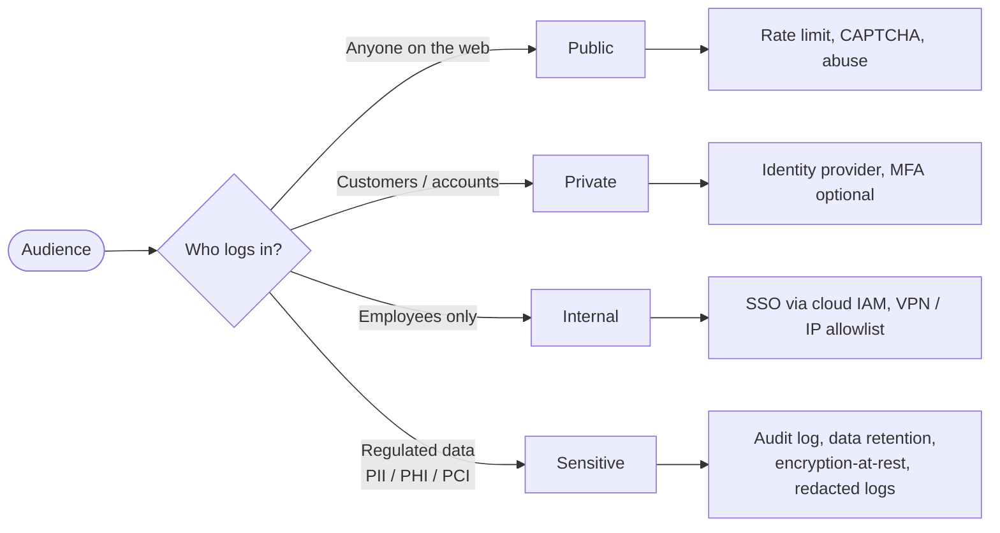
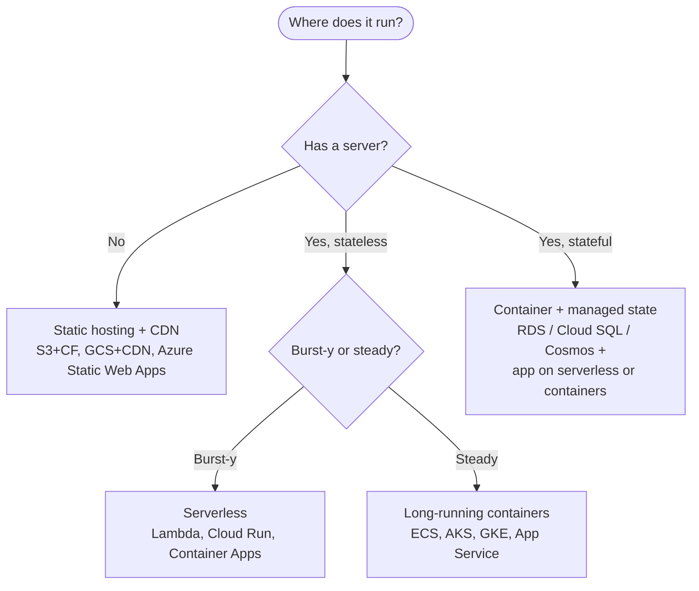

# Choosing a Web App Path

Last Updated: 2026-05-13

The kickoff interview (`/ai/templates/KICKOFF_NEW_SOLUTION.md`) asks one
question at a time so you don't have to know everything up front. This
doc is the map behind those questions. Use it to:

- Spot which kind of web app you're actually building (they look more
  similar than they are).
- Surface the right follow-up questions early — auth, payments, data
  sensitivity, realtime, external AI cost, deployment shape.
- Check that the kit's defaults (managed services, IaC, OIDC, secret
  stores, monthly budget caps) make sense for your case, or write the
  ADR overriding them.

If you're already deep in setup, jump to the [Question Checklist](#question-checklist)
at the bottom — that's the canonical list KICKOFF / INIT walks you through.

---

## 1. High-level decision tree

```mermaid
flowchart TD
    Start([What are you building?]) --> Q1{Does it have a server-side<br/>process you own?}

    Q1 -- "No, just files" --> Static{Mostly content?}
    Static -- "Marketing / landing" --> S1[Static marketing site]
    Static -- "Docs / wiki / blog" --> S2[Documentation / content site]
    Static -- "App shell, dynamic via APIs" --> SPA[Frontend SPA<br/>+ external APIs]

    Q1 -- "Yes" --> Q2{Do users sign in?}

    Q2 -- "No" --> Q3{Is it public<br/>+ stateless reads?}
    Q3 -- "Yes" --> API[Public API service<br/>or read-only app]
    Q3 -- "No, stores user input" --> Q4{Will inputs reach<br/>real people / be<br/>regulated?}
    Q4 -- "Yes" --> Sens[Treat as sensitive:<br/>auth, audit, retention]
    Q4 -- "No" --> Lite[Lightweight CRUD<br/>without accounts]

    Q2 -- "Yes" --> Q5{Are accounts<br/>per-tenant<br/>(orgs / workspaces)?}
    Q5 -- "Yes, multi-tenant" --> SaaS[B2B SaaS]
    Q5 -- "No, individuals" --> Q6{Is the product itself<br/>the AI experience?}
    Q6 -- "Yes" --> AIApp[AI-first app]
    Q6 -- "No" --> Q7{Money changes hands<br/>on the platform?}
    Q7 -- "Yes" --> Q8{Marketplace<br/>or single seller?}
    Q8 -- "Single seller / catalog" --> Ecom[E-commerce]
    Q8 -- "Many sellers" --> Market[Marketplace]
    Q7 -- "No" --> Q9{Multi-user state<br/>changes live?}
    Q9 -- "Yes" --> RT[Realtime / collaboration app]
    Q9 -- "No" --> Q10{Audience: internal staff<br/>vs external users?}
    Q10 -- "Internal staff" --> Internal[Internal dashboard / tool]
    Q10 -- "External users" --> CRUD[Full-stack CRUD app]
```

Each leaf in the tree is a starting *shape*. The kit doesn't pick a
framework for you — that lands as an ADR in `/ai/DECISIONS.md` during
init — but the shape tells the kickoff interview which follow-up
questions matter.

---

## 2. Shape → what to expect

| Shape | Typical pages | Auth? | Payments? | User data? | Realtime? | AI cost? |
|---|---|---|---|---|---|---|
| Static marketing site | landing, pricing, blog | no | no | no (forms only) | no | no |
| Documentation / content site | docs, search | maybe | no | low | no | optional |
| Frontend SPA + external APIs | app shell hitting 3rd-party APIs | maybe | maybe | varies | varies | varies |
| Public API service | API endpoints, no UI | API keys | no | n/a | maybe | maybe |
| Lightweight CRUD (no auth) | forms, dashboards | no | no | low | no | no |
| Sensitive form intake | forms, admin view | yes (admin) | no | **yes** | no | no |
| Full-stack CRUD (auth) | app pages, user profile | yes | no | yes | optional | optional |
| B2B SaaS | login, org switcher, billing, admin | yes | yes | yes | optional | varies |
| AI-first app | chat / generation surfaces | yes | usually | yes | streaming | **yes** |
| E-commerce | catalog, cart, checkout, orders | optional | **yes** | yes | optional | no |
| Marketplace | listings, two-sided UX, payouts | yes | **yes** | yes | optional | no |
| Realtime / collaboration | live boards, presence | yes | maybe | yes | **yes** | optional |
| Internal dashboard / tool | admin views, exports | yes (SSO) | no | maybe | optional | optional |

"Optional" means the question matters but doesn't change the shape; the
kickoff interview will ask anyway and record the answer as an ADR.

---

## 3. Cross-cutting axes (the questions KICKOFF always asks)

These apply to every shape above. Each maps to a (Hard) rule in
`/ai/AI_RULES.md` that the kit enforces by default; override per project
with an ADR.

### 3.1 Audience and sensitivity



The starter's **Security Rules** (auth via vetted libs, argon2id,
deny-by-default authz, redacted logs, OIDC for CI) already cover the
common path. Sensitive data adds **audit logging**, **retention
policies**, and **legal review** — flag these in `/ai/SPEC.md` during
init.

### 3.2 Auth / no auth

- **No auth** → only fine for purely informational sites or
  single-user dev tools you run locally. Anything that stores
  per-user state graduates to auth.
- **Auth** → use a battle-tested provider (Auth0, Clerk, AWS Cognito,
  Azure AD B2C, Google Identity, Supabase Auth, or a vetted library
  like next-auth, Devise, FusionAuth). **Never roll your own.**
- Record the choice + version + verification date as an ADR.

### 3.3 User data / no user data

- **No user data** → still apply input validation + CORS rules; you'll
  almost always grow into user data.
- **User data** → schema-validate at trust boundaries, redact PII in
  logs, encrypt at rest (managed service defaults), define retention
  in `/ai/SPEC.md`, list deletion / export paths if GDPR / CCPA
  applies. Mark these requirements in tasks early — they're cheap
  to design in, expensive to retrofit.

### 3.4 Payments

- **One-time / subscription** → Stripe / Paddle / Lemon Squeezy /
  Adyen — never roll your own. PCI scope stays at the provider.
- **Marketplaces / payouts** → Stripe Connect, Adyen for Platforms,
  PayPal Marketplaces. Adds KYC, payouts, refunds, dispute handling.
- Webhooks are a security surface: verify signatures, rate-limit,
  idempotency keys for retries. Add an ADR for the provider and a
  task for the webhook handler.

### 3.5 External APIs (incl. AI providers)

- Every external API is a **cost vector + reliability dependency**.
  Add an ADR: provider, free-tier limits, expected monthly cost.
- For **AI providers** specifically: pricing is per-token, easy to
  blow past a budget cap. Add to `/ai/BUDGET.md`'s Free-tier
  section, set per-feature rate limits, log token usage from day one.
- Server-side calls only — never expose an AI provider key in the
  browser. The starter's Secret Rules forbid it.

### 3.6 Realtime

- **No realtime** → standard request/response. Easy mode.
- **Soft realtime** (polling every N seconds) → fine for activity
  feeds, status pages.
- **True realtime** (WebSockets / SSE / WebRTC / CRDTs) → choose the
  transport early (Ably, Pusher, AWS AppSync, Cloudflare Durable
  Objects, self-hosted Socket.io) and write an ADR. Affects auth
  (token issuance, ticket exchange), infra (sticky sessions or stateless
  pub/sub), and cost (per-connection or per-message pricing).

### 3.7 Admin tools / internal dashboards

- Treat the admin surface as a **separate trust zone**: separate auth
  (admin SSO), separate route prefix (`/admin/*`), tighter rate
  limits, full audit log, no "switch to user" without explicit
  consent.
- For very-internal tools, **Retool / Appsmith / Forest Admin** beat
  building from scratch if the data lives in a DB the tool can reach.
  Record the choice as an ADR.

### 3.8 Deployment / infrastructure shape



The Hard rules:
- **Cloud target**: AWS, Azure, or Google Cloud. Anything else (Vercel,
  Fly, Cloudflare, Hetzner, on-prem) needs an ADR explaining why.
- **IaC**: Terraform (or OpenTofu) for everything you own. No
  click-ops in QA or prod.
- **Stateful services in QA/Prod**: cloud-managed (RDS, Cloud SQL,
  ElastiCache, S3, etc.). Self-hosting stateful workloads in
  containers needs an ADR.
- **Local dev**: containerize stateful deps (Docker Compose / Podman /
  OrbStack / Lima — pick one, record in `DEV_ENVIRONMENT.md`).
- **Secrets**: cloud secret store (Secrets Manager / Key Vault /
  Secret Manager). Never in code, manifests, or `.env` files in CI.

---

## 4. Question Checklist

The kickoff interview asks all of these. You can also use this list to
self-audit before starting init.

1. **What does the app DO for users?** Concrete feature loop, not
   architecture. (The interview will reject "foundation" answers.)
2. **Audience**: public, private (customers), internal (employees),
   sensitive (regulated)?
3. **Auth**: any sign-in? Which provider? MFA? SSO for internal?
4. **User data**: what's stored, how long, what's PII / regulated?
   Deletion / export obligations?
5. **Payments**: one-time, subscription, marketplace, none?
6. **External APIs**: which? Free-tier limits? Reliability dependency?
7. **AI cost**: any per-token external calls? Monthly cap?
8. **Realtime**: none / polling / WebSockets / WebRTC / CRDTs?
9. **Admin surface**: separate from user UI? Audit log needed?
10. **Deployment shape**: static / serverless / long-running container /
    stateful? Cloud (AWS/Azure/GCP) — and why if not those three?
11. **Compliance**: GDPR / CCPA / HIPAA / PCI-DSS / SOC 2 / FedRAMP?
12. **Performance targets**: p95 latency, availability SLO, peak RPS?
13. **Accessibility target**: WCAG 2.2 AA is the kit default; record
    any narrower scope as an ADR.
14. **Budget**: monthly cap, alert thresholds (50/80/100%), free-tier
    fallbacks?
15. **Team shape**: solo / pair / >2 — affects branch protections,
    PR review requirements (recorded in `/ai/WORKFLOW.md`).

If you can answer 1–10 in one or two sentences each, you're ready to
run `/ai/templates/INIT_PROMPT.md` directly. If any are still fuzzy,
let the **KICKOFF** interview walk you through them.

---

## 5. Defaults the kit will assume unless you override

These come from `/ai/AI_RULES.md` and apply to every project:

- TLS-only; no plaintext HTTP outside localhost.
- Auth via a vetted library or provider; argon2id for password hashing.
- Deny-by-default authorization; per-IP + per-account rate limiting on
  public endpoints.
- Logs redact PII and secrets; CORS / CSP allowlists, no wildcards in
  prod.
- Dependency scanning + SAST enabled in CI from day one.
- CI authenticates to cloud via OIDC federation — no long-lived
  cloud keys in repo secrets.
- Managed stateful services in QA + prod (RDS / Cloud SQL /
  ElastiCache / etc.). Self-hosting needs an ADR.
- Monthly budget cap + 50/80/100% alerts wired up at init.

If your app legitimately needs to break one of these, the kit asks you
to write an ADR before doing it. That keeps overrides explicit instead
of accidental.
