# Project Shape Gallery

Last Updated: 2026-05-13

A visual catalog of the project shapes the `ai-starter` kit can plan
for. Each shape is broken into **rungs** — from simplest to most
complex — with a small Mermaid diagram, a one-line description, a few
example projects, and the default stack dimensions the kickoff
dimension walk will pre-fill if you pick that rung.

## How to use this gallery

The `KICKOFF_NEW_PROJECT.md` and `KICKOFF_EXISTING_PROJECT.md`
interviews use this gallery in two ways:

1. After the diagnostic (D1–D5) narrows your project to a set of
   **components**, the AI shows you the rung ladder for each component
   and asks "which rung looks closest?" You can answer with the rung
   name, "between rung 3 and rung 4," or "rung 4 but with the file
   uploads from rung 5."
2. The picked rung **pre-fills the default dimensions** for that
   component, so the dimension walk only asks about deviations rather
   than every choice from scratch.

A real project is usually **1-N components**: a web app + API + static
docs site, or a CLI + library + backend, or a mobile app + backend +
admin web. The composite diagram for your project is just the picked
rungs assembled side by side with cross-component edges.

Diagrams are **role-labeled** (`managed DB`, `edge functions`, `auth
provider`) rather than vendor-labeled, so they age well. Vendor and
version choices belong in the dimension walk and ADRs, not in the
gallery.

## Components in this gallery

1. [Web app](#web-app)
2. [Static site](#static-site)
3. [API service](#api-service)
4. [CLI tool](#cli-tool)
5. [Library / SDK](#library--sdk)
6. [Mobile app](#mobile-app)
7. [Desktop app](#desktop-app)
8. [Data / ML pipeline](#data--ml-pipeline)
9. [Plugin / extension](#plugin--extension)

Plus [composite examples](#composite-examples) showing how components
combine in real projects.

---

## Web app

Often paired with: API service (when frontend and backend split),
Static site (for marketing/docs), Mobile app (companion), CLI
(internal admin/ops tools).

### Web R1 — Pure static

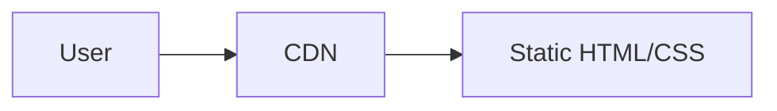

One page or a few pages, no backend, no forms, no auth. Site visitors
just read.

Examples: personal portfolio, landing page for a side project, hobby
blog, single-event splash page.

Default dimensions:
- Generator: hand-written HTML/CSS or a minimal SSG
- Host: CDN-backed static hosting
- Analytics: optional, lightweight
- No backend, no DB, no auth

### Web R2 — Static + form

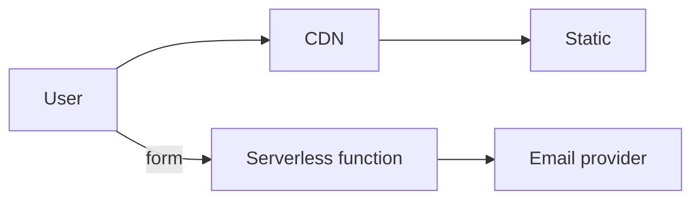

Static pages with a contact form, newsletter signup, or single
"submit" action. No auth, no DB.

Examples: small-business marketing site with contact form, freelance
portfolio with inquiry form, side-project landing with email capture.

Default dimensions:
- Generator: SSG
- Host: CDN-backed static hosting
- Serverless platform for form handler
- Email provider for the resulting message
- No backend service, no DB, no auth

### Web R3 — JAMstack + auth + headless CMS

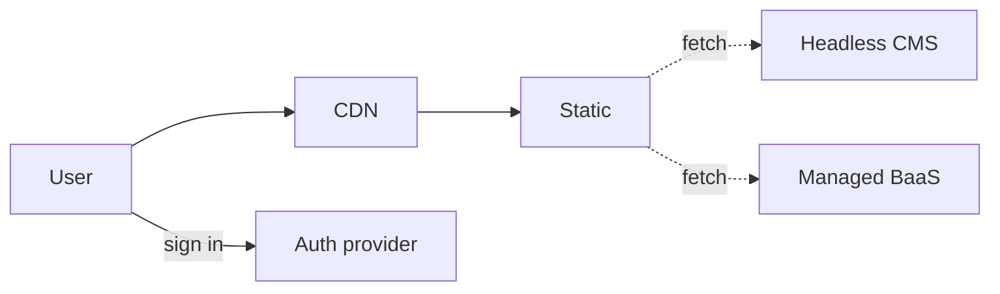

Static frontend, content from a CMS, auth from a managed provider,
data from a managed backend-as-a-service (Firebase, Supabase,
PocketBase, etc.). You don't operate your own database.

Examples: content-driven membership site, paid newsletter platform,
small community site, lightweight SaaS.

Default dimensions:
- Generator: SSG with islands / partial hydration
- Headless CMS
- Auth provider
- Managed BaaS for data
- No self-operated DB, no separate API service

### Web R4 — Server-rendered web app with DB

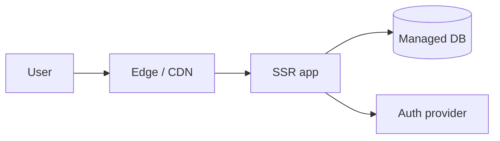

Server-rendered framework (Next.js / Remix / Rails / Django / Laravel
/ Phoenix style) that owns its database. One deployable. Common
"first real SaaS" shape.

Examples: small SaaS, internal tool, content-heavy app with user
accounts, MVP for a startup.

Default dimensions:
- SSR framework
- Managed DB (Postgres-shaped typically)
- ORM or query builder
- Auth provider OR in-app auth
- Email provider for transactional email
- Observability (lightweight: cloud-native logs + uptime)

### Web R5 — Web + API split + storage + payments + email + admin

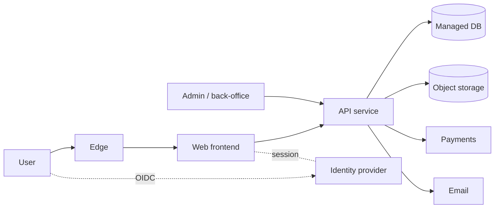

Frontend and API are separate deployables, managed Postgres-shaped
DB, object storage for uploads, third-party payments, transactional
email, and an admin surface. This is where most "real" web products
land.

Examples: B2C subscription product with mailing/order workflow,
marketplace, ops-heavy SaaS, CRM-style internal app, multi-feature
consumer app.

Default dimensions:
- Frontend framework (SSR or SPA)
- Backend API framework (separate process)
- Managed DB
- ORM
- Identity provider (CIAM)
- Object/blob storage
- Email provider
- Payments provider
- Admin UI (either inside frontend or separate)
- Observability (cloud-native + optional vendor)

### Web R6 — Multi-region production SaaS

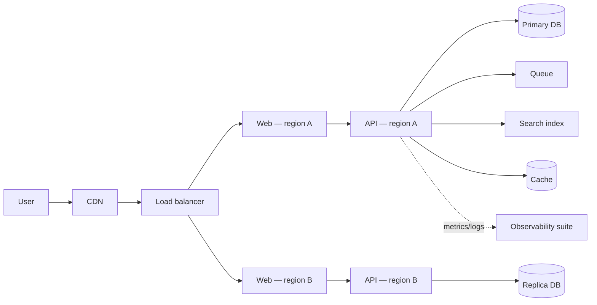

Multi-region, CDN, queue, search, cache, full observability stack.
SOC 2 / DR planning kicks in. Production SaaS at scale.

Examples: established SaaS serving customers in multiple regions,
high-traffic consumer app, enterprise-targeted product.

Default dimensions:
- Everything in R5, plus:
- Multi-region deploy
- Queue / background jobs
- Search index
- Cache layer
- Full observability suite (metrics + traces + logs + on-call)
- DR plan and runbooks

---

## Static site

Often paired with: API service (form handlers), Web app (marketing
site for the app), CLI (build/deploy tooling).

Static-site rungs overlap with Web R1–R3 — pick the static section
when the project is *just* a static site, not the marketing surface
of a larger product.

### Static R1 — Hand-written HTML/CSS

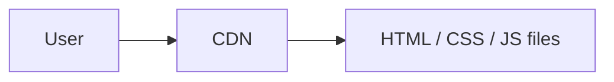

A handful of HTML files served from a CDN. No build step.

Examples: personal homepage, single landing page, link-in-bio page.

Default dimensions:
- Just HTML/CSS/JS files
- Static host (any CDN-backed option)
- Optional analytics

### Static R2 — SSG (Astro / Hugo / Jekyll / 11ty)

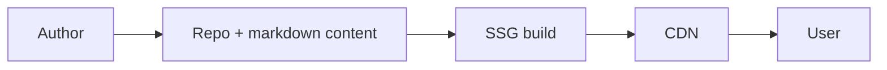

Build-time generated static site. Content in markdown, output is
static HTML.

Examples: dev blog, docs site, marketing site for an open-source
project, course site.

Default dimensions:
- SSG framework
- Static host
- Build pipeline (CI on push)
- Optional analytics, search (lunr / pagefind / typesense)

### Static R3 — SSG + form via serverless

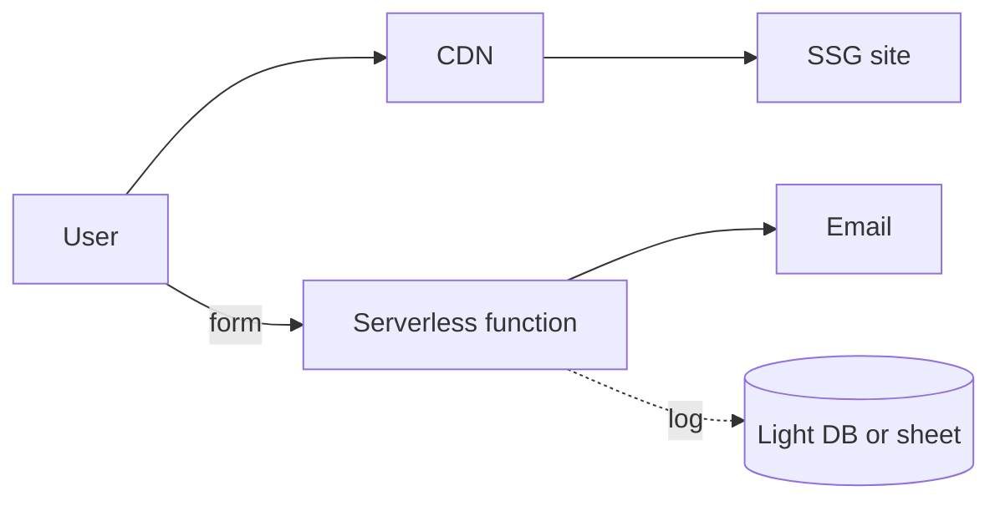

Static + contact form / newsletter / lead capture.

Examples: small-business marketing, freelance site with inquiry form,
launch landing with waitlist signup.

Default dimensions:
- SSG + static host
- Serverless platform
- Email provider
- Optional lightweight data store (sheet, KV, BaaS)

### Static R4 — SSG + CMS + edge functions

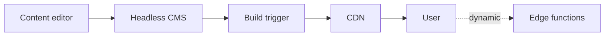

Content managed via headless CMS, build triggered by CMS publish,
some dynamic logic at the edge (A/B, personalization, region routing,
auth checks).

Examples: marketing site with frequent content updates, multi-author
blog, localized marketing site.

Default dimensions:
- SSG + static host with edge runtime
- Headless CMS
- Build trigger / preview URLs
- Edge function runtime for dynamic bits

---

## API service

Often paired with: Web app (frontend), Mobile app (consumer), CLI
(client), Static site (docs), Library/SDK (client SDKs).

### API R1 — Single serverless function

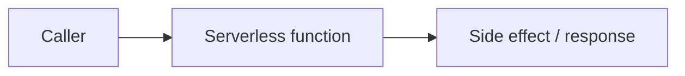

One endpoint. Webhook handler, simple proxy, single computation.
Often stateless.

Examples: webhook receiver, image-resize endpoint, OAuth callback,
simple inference proxy.

Default dimensions:
- Single function on a serverless platform
- No DB OR a managed BaaS for tiny state
- Auth: API key, signed webhook, or none
- Observability: platform-native logs

### API R2 — REST API + DB

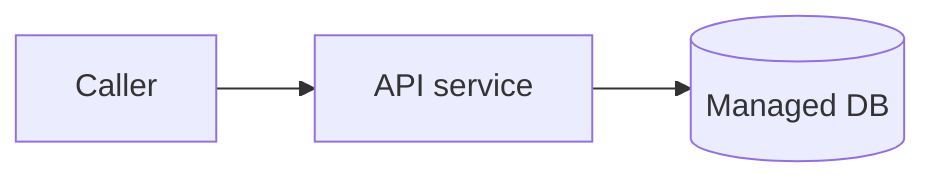

Multi-endpoint REST API, owns its data. Stateful, no auth (or simple
API key).

Examples: small backend for a mobile app, internal microservice,
data-fetch backend for a SPA.

Default dimensions:
- API framework
- Managed DB
- ORM or query builder
- Schema validation library
- Observability (cloud-native logs)

### API R3 — REST API + DB + auth + queue

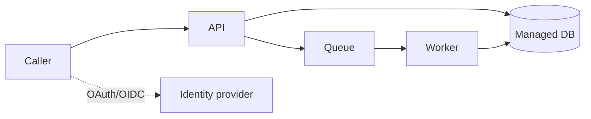

Authenticated API with background jobs (email sending, file
processing, periodic tasks).

Examples: typical SaaS backend, webhook processor with retries,
import/export backend.

Default dimensions:
- API framework
- Managed DB + ORM
- Auth (identity provider or in-app)
- Queue / background job runner
- Worker process
- Schema validation
- Observability

### API R4 — GraphQL API + DB + auth

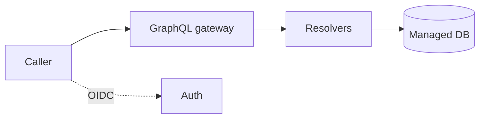

GraphQL instead of REST. Schema-first contract, flexible shape for
frontend.

Examples: backend for data-shape-flexible product, content-platform
backend, multi-frontend backend.

Default dimensions:
- GraphQL framework
- DB + ORM
- Auth
- Dataloader / caching layer (often)
- Schema federation if multi-team

### API R5 — Multi-service backend with gateway

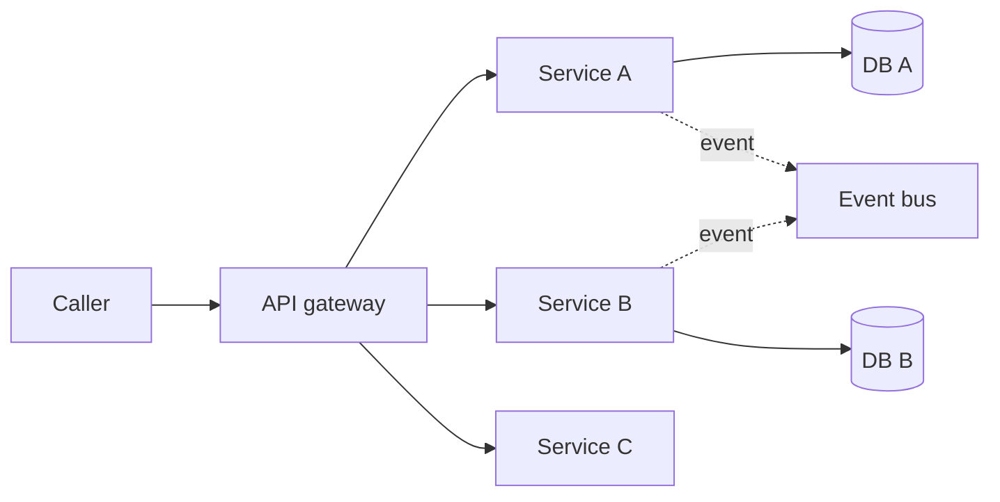

Multiple services behind a gateway, event bus for cross-service
communication.

Examples: microservices backend, platform with independent product
domains, larger team with service ownership.

Default dimensions:
- Gateway (API gateway / service mesh)
- Multiple service deployments
- Per-service DB OR shared with strict boundaries
- Event bus / message broker
- Distributed tracing in observability stack

---

## CLI tool

Often paired with: Library/SDK (the CLI wraps a library), API service
(the CLI is a client to a hosted service), Static site (docs).

### CLI R1 — Single-file script

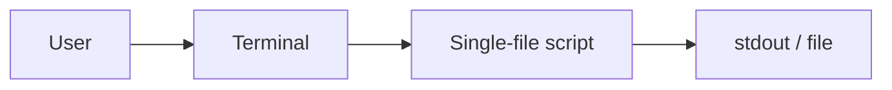

One file, possibly zero dependencies. Bash, Python, Node, Go, Rust,
etc. Run it locally.

Examples: personal automation, repo cleanup script, one-off data
massager.

Default dimensions:
- Language + runtime (or compiled binary)
- No package manager OR script-level deps
- Distribution: copy-paste or `chmod +x`
- Tests: optional, often skipped at this size

### CLI R2 — Multi-file CLI with deps

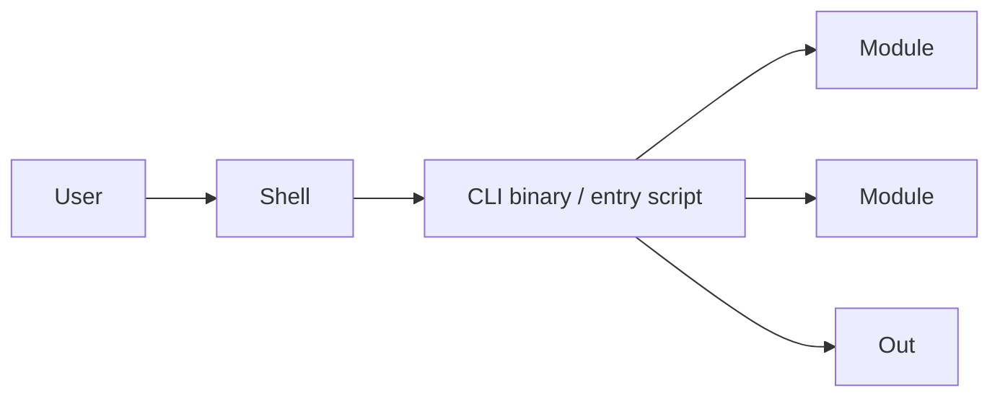

Compiled binary or packaged script with multiple modules and
external dependencies. Distributed via a package registry or binary
release.

Examples: dev tooling for a team, code generator, custom linter,
project scaffolder.

Default dimensions:
- Language + runtime
- Package manager
- Test framework
- Lint / format
- Distribution: package registry (npm / PyPI / Homebrew /
  crates.io / Go) OR binary release on GitHub Releases
- Release automation (changesets / release-please / semantic-release)

### CLI R3 — CLI with plugin system

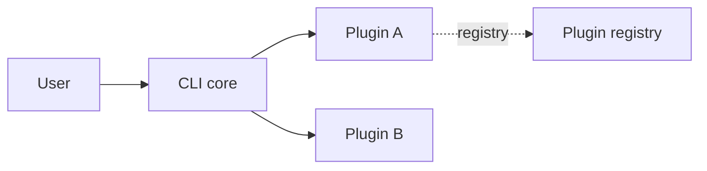

CLI with an extension/plugin architecture so third parties can extend
it.

Examples: `kubectl` plugins, `helm` plugins, `gh` extensions, `eslint`
config + plugins.

Default dimensions:
- All of R2
- Plugin loading mechanism (filesystem, registry, runtime require)
- Plugin contract / API
- Plugin discovery and listing commands

### CLI R4 — CLI + own backend API

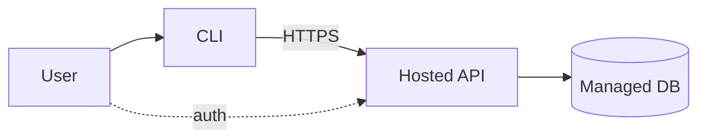

CLI is a client to a hosted service you also operate. The CLI
authenticates, sends commands, and shows results from the API.

Examples: `stripe` CLI, `vercel` CLI, `supabase` CLI, `gh` CLI.

Default dimensions:
- All of R2, plus on the backend side: API R3 (REST + DB + auth) as
  a separate component
- Authentication flow: device code, browser-redirect, or token
- Local credential storage (OS keychain preferred)

### CLI R5 — CLI + library + plugin system + backend

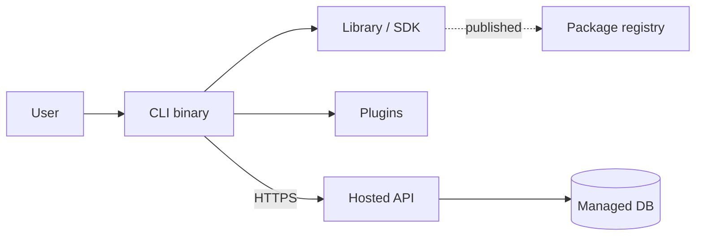

Full developer-tool shape: a library others can also embed, a CLI
that wraps the library, a plugin system, and an optional hosted
backend.

Examples: Terraform (CLI + plugins + registry), `ai-starter` itself
(workflow files + harness scripts), modern devtool platforms.

Default dimensions:
- Combination of CLI R3 + Library R2 + API R3 (if backend exists)

---

## Library / SDK

Often paired with: CLI (thin wrapper), API service (the SDK calls it),
Static site (docs).

### Library R1 — Single-language library

```mermaid
flowchart LR
  Dev[Developer] -- imports --> Lib[Library]
  Lib --> App[Their app]
```

Importable library in one language. No CLI, no backend.

Examples: utility library, framework adapter, parser, data-structure
library.

Default dimensions:
- Language + runtime version policy
- Package manager + registry (npm / PyPI / Maven / crates.io / etc.)
- Test framework
- Lint / format
- Release automation
- API docs generator

### Library R2 — Library + CLI wrapper

```mermaid
flowchart LR
  Dev -- imports --> Lib
  User -- runs --> CLI[CLI wrapper]
  CLI --> Lib
```

The same logic is available as both a library (for programmatic use)
and a CLI (for ad-hoc use).

Examples: ESLint, Prettier, Black, ruff, mypy.

Default dimensions:
- Library R1, plus CLI R2 as a paired component

### Library R3 — SDK for a hosted service

```mermaid
flowchart LR
  Dev -- imports --> SDK
  SDK -- HTTPS --> API[Third-party / own API]
```

Client SDK that wraps HTTP calls to a hosted API. May be
auto-generated from an OpenAPI / GraphQL schema.

Examples: `stripe-node`, `openai-python`, AWS SDK, vendor-specific
clients.

Default dimensions:
- Library R1
- HTTP client (built-in or fetch wrapper)
- Auth handling (API keys, OAuth)
- Retries / pagination / rate-limit handling
- Code-gen pipeline if schema-driven

### Library R4 — Multi-language SDK family

```mermaid
flowchart LR
  Schema[OpenAPI / IDL spec] --> Gen[Code generator]
  Gen --> SDKa[JS SDK]
  Gen --> SDKb[Python SDK]
  Gen --> SDKc[Go SDK]
  SDKa --> API[Hosted API]
  SDKb --> API
  SDKc --> API
```

One product, multiple language clients, generated from a shared
schema.

Examples: AWS SDKs, Stripe SDKs, Twilio SDKs, Algolia clients.

Default dimensions:
- Shared schema (OpenAPI / smithy / proto / GraphQL)
- Code generator
- Per-language test framework, package manager, release automation
- Versioning policy across languages (sync vs. independent)

---

## Mobile app

Often paired with: API service (own backend), Web app (companion or
marketing), Static site (App Store landing).

### Mobile R1 — Standalone

```mermaid
flowchart LR
  User --> App[Mobile app]
  App --> Local[(Local storage)]
```

All logic on-device. No network calls, no backend, no accounts.

Examples: calculator, timer, simple game, offline reference app.

Default dimensions:
- Native (Swift / Kotlin) OR cross-platform (React Native / Flutter
  / Expo)
- Local persistence (Core Data / Room / SQLite / SecureStore)
- Test framework
- Crash reporting
- App Store + Play Store distribution

### Mobile R2 — Mobile + read-only third-party API

```mermaid
flowchart LR
  User --> App
  App -- HTTPS --> API[Third-party API]
  App --> Local[(Cache)]
```

Reads data from someone else's API. No own backend, no accounts.

Examples: weather app, news reader, transit-times app, public-data
viewer.

Default dimensions:
- All of R1
- HTTP client
- Local cache layer
- Network reachability handling

### Mobile R3 — Mobile + own backend + auth

```mermaid
flowchart LR
  User --> App
  App --> API[Own API]
  API --> DB[(Managed DB)]
  User -.OIDC.-> Auth[Identity provider]
```

Authenticated. Owns server-side state. Backend stores user data.

Examples: typical social app, productivity app with sync, fitness
tracker.

Default dimensions:
- Mobile R1
- Plus API R3 (REST + DB + auth) as a paired component
- Identity provider (Apple / Google / email / custom)
- Push notifications

### Mobile R4 — Mobile + backend + push + storage + payments

```mermaid
flowchart LR
  User --> App
  App --> API[Own API]
  API --> DB[(DB)]
  API --> Store[(Object storage)]
  API --> Push[Push service]
  API --> Pay[Payments / IAP]
  User -.OIDC.-> Auth
```

Full mobile SaaS. Uploads, push, payments (in-app purchases or
Stripe), background jobs.

Examples: ride-sharing, food delivery, marketplaces, subscription
apps with media.

Default dimensions:
- Mobile R3
- Object storage for uploads
- Push notifications (APNs / FCM)
- Payments (App Store IAP / Play Billing / Stripe)
- Background tasks
- Deep linking

### Mobile R5 — Cross-platform + shared backend + offline sync

```mermaid
flowchart LR
  iOS[iOS app] --> API
  Android[Android app] --> API
  Web[Web companion] --> API
  API --> DB[(DB)]
  iOS -.sync.-> Sync[Sync engine]
  Android -.sync.-> Sync
  Sync --> DB
```

One product across platforms with offline-capable sync. Shared API
backs all clients.

Examples: collaborative note-taking, drawing apps, cross-device
productivity tools.

Default dimensions:
- React Native / Flutter / Kotlin Multiplatform — pick one
- Sync engine (CRDT-based / operational transform / custom diff)
- Conflict resolution strategy
- Shared backend (API R3+)
- Web companion (Web R4 typically)

---

## Desktop app

Often paired with: API service (backend for sync), Web app
(companion), Static site (download page).

### Desktop R1 — Standalone

```mermaid
flowchart LR
  User --> App[Desktop app]
  App --> FS[(Local files)]
```

Local-only. All state on disk.

Examples: text editor, single-user note app, calculator, simple
utility.

Default dimensions:
- Framework: Electron / Tauri / native (Swift / .NET / Qt)
- Local persistence (SQLite / files)
- Test framework
- Code signing + notarization
- Auto-update mechanism
- Distribution: direct download / GitHub Releases / store

### Desktop R2 — Desktop + cloud sync

```mermaid
flowchart LR
  User --> App
  App --> Local[(Local store)]
  App -.sync.-> API[Sync API]
  API --> Cloud[(Cloud store)]
```

Local-first with cloud sync. User signs in once; data syncs across
devices.

Examples: note-taking apps with sync, read-later apps, password
managers.

Default dimensions:
- Desktop R1
- Sync API as a paired component (API R3)
- Auth provider
- Conflict-resolution strategy

### Desktop R3 — Desktop + auth + collaborative backend

```mermaid
flowchart LR
  User1[User A] --> App1[Desktop A]
  User2[User B] --> App2[Desktop B]
  App1 -. realtime .-> RT[Realtime service]
  App2 -. realtime .-> RT
  RT --> DB[(DB)]
```

Multi-user, real-time. Multiple desktops collaborate on shared state.

Examples: design tools, IDEs with collab features, real-time
whiteboards.

Default dimensions:
- Desktop R2
- Realtime backend (WebSocket / WebRTC / CRDT replication)
- Presence + cursors
- Operational transform or CRDT for merges

### Desktop R4 — Desktop + companion (web/mobile)

```mermaid
flowchart LR
  Desktop[Desktop app] --> API
  Web[Web app] --> API
  Mobile[Mobile app] --> API
  API --> DB[(DB)]
```

Same product, multiple surfaces. Desktop is one of several clients
of the same backend.

Examples: 1Password (desktop + browser extension + mobile), Notion,
Slack, Dropbox.

Default dimensions:
- Desktop R2 OR R3
- Plus Web app component (Web R4+) and/or Mobile app component
- Shared identity, billing, and data plane

---

## Data / ML pipeline

Often paired with: API service (for downstream consumers), Web app
(dashboard), Static site (data catalog docs).

### Data R1 — Single script on a schedule

```mermaid
flowchart LR
  Cron[Cron / scheduler] --> Script[Script]
  Script --> Src[(Source)]
  Script --> Dest[(Destination)]
```

One script, scheduled. Pulls from a source, writes to a destination.

Examples: nightly CSV import, weekly metric snapshot, simple ETL
between two SaaS tools.

Default dimensions:
- Language + runtime
- Scheduler (cron / GitHub Actions / cloud scheduler)
- Source connector(s)
- Destination (file / DB / spreadsheet)
- Secrets store for connector credentials
- Logging destination

### Data R2 — ETL with orchestrator + warehouse

```mermaid
flowchart LR
  Sources[(Sources)] --> Orch[Orchestrator]
  Orch --> Ext[Extract]
  Ext --> Transform[Transform]
  Transform --> WH[(Warehouse)]
  WH --> BI[BI tool]
```

Orchestrator (Airflow / Dagster / Prefect / Mage) coordinates batch
ETL into a cloud warehouse.

Examples: business analytics ETL, finance reporting pipeline,
customer 360 pipeline.

Default dimensions:
- Orchestrator
- Warehouse (Snowflake / BigQuery / Redshift / Databricks)
- Transform tool (dbt / SQLMesh / hand-written)
- Source connectors (Fivetran / Airbyte / hand-written)
- Secrets store
- Observability + data quality checks

### Data R3 — Stream processing + warehouse

```mermaid
flowchart LR
  Sources --> Bus[Event bus / Kafka]
  Bus --> Stream[Stream processor]
  Stream --> WH[(Warehouse)]
  Stream --> Live[(Realtime store)]
```

Event-driven, near-real-time. Stream processor reads from a bus,
writes to warehouse and possibly a low-latency store for live
queries.

Examples: real-time analytics, fraud detection, live dashboards,
operational metrics.

Default dimensions:
- Event bus (Kafka / Kinesis / Pub/Sub / Event Hubs)
- Stream processor (Flink / Spark Streaming / Beam / ksqlDB)
- Warehouse + transformations
- Realtime serving store (if needed)
- Schema registry

### Data R4 — ETL + warehouse + ML training + experiment tracking

```mermaid
flowchart LR
  Sources --> Orch
  Orch --> WH[(Warehouse)]
  WH --> Feat[Feature store]
  Feat --> Train[Training pipeline]
  Train --> Reg[Model registry]
  Reg --> Serve[Inference service]
  Train --> Exp[Experiment tracking]
```

Data pipeline plus ML training, experiment tracking, and a model
registry feeding inference.

Examples: recommendation model pipeline, churn prediction, demand
forecasting, classifier training.

Default dimensions:
- Data R2 (orchestrator + warehouse + transforms)
- Feature store (Feast / Tecton / hand-rolled)
- Training framework (sklearn / PyTorch / TensorFlow / XGBoost)
- Experiment tracking (MLflow / Weights & Biases / Comet)
- Model registry
- Inference service (managed or self-hosted)

### Data R5 — Full data platform

```mermaid
flowchart LR
  Sources --> Bus[Event bus]
  Sources --> Orch[Orchestrator]
  Bus --> Stream[Stream]
  Orch --> WH[(Warehouse)]
  Stream --> WH
  WH --> Transform[dbt / SQLMesh]
  Transform --> Marts[(Marts)]
  Marts --> ML[ML training]
  Marts --> BI[BI / dashboards]
  ML --> Serve[Inference]
  WH -.lineage.-> Cat[Catalog]
  Stream -.metrics.-> Obs[Observability]
```

Production data platform: orchestrator + warehouse + transformations
+ ML + serving + observability + lineage + catalog.

Examples: enterprise data team output, mature analytics org,
data-product platform.

Default dimensions:
- Data R3 + Data R4 combined
- Data catalog + lineage (DataHub / OpenMetadata / Atlan / Unity)
- Data quality framework (Great Expectations / Soda)
- Cost monitoring per warehouse query
- Per-domain ownership (data mesh patterns)

---

## Plugin / extension

Often paired with: API service (own backend), Static site (docs and
listing).

### Plugin R1 — Pure client-side

```mermaid
flowchart LR
  User --> Host[Host app]
  Host --> Plugin[Plugin]
  Plugin --> Host
```

Lives entirely in the host (browser / IDE / chat). No backend, no
auth, no data exfiltrated.

Examples: theme, formatter, simple snippet manager, syntax-highlight
add-on.

Default dimensions:
- Target host platform (Chrome / Firefox / Safari / VS Code /
  JetBrains / Raycast / etc.)
- Manifest (manifest v3 / vsix / etc.)
- Bundler
- Test framework
- Distribution: store listing (Chrome Web Store / VS Code
  Marketplace)

### Plugin R2 — Client + auth flow with provider

```mermaid
flowchart LR
  User --> Host --> Plugin
  Plugin -.OAuth.-> Provider[Third-party API]
```

Extension authenticates the user against a third-party service and
reads/writes data there. No own backend.

Examples: GitHub-aware extensions, Notion-aware extensions, Slack
slash commands that hit Slack only.

Default dimensions:
- Plugin R1
- OAuth client implementation in the extension
- Token storage (host-provided secure storage)
- Provider API client

### Plugin R3 — Client + own hosted backend

```mermaid
flowchart LR
  User --> Host --> Plugin
  Plugin -- HTTPS --> API[Own API]
  API --> DB[(Managed DB)]
  User -.auth.-> API
```

Extension + your own backend. Backend stores sync state, sharing
state, or settings.

Examples: extensions with cross-device sync, team-share features,
licensing servers.

Default dimensions:
- Plugin R1
- Plus API R3 (REST + DB + auth) as a paired component
- Auth bridge from extension to API

### Plugin R4 — Client + backend + AI inference

```mermaid
flowchart LR
  User --> Host --> Plugin
  Plugin --> API[Own API]
  API --> AI[Inference service]
  API --> DB[(DB)]
  AI -. logs .-> Obs[Observability]
```

AI-powered extension. Backend brokers inference calls (often for cost
control, auth, or to add private context).

Examples: Copilot-style code assistants, AI-powered writing
extensions, smart browser assistants.

Default dimensions:
- Plugin R3
- AI provider (managed inference / own model serving)
- Prompt / context layer
- Cost monitoring per request
- Streaming response handling

---

## Composite examples

Real projects almost always combine components. Here are common
shapes you'll recognize.

### Composite — SaaS marketing + web app + API

```mermaid
flowchart LR
  Visitor --> Marketing[Marketing site]
  User --> WebApp[Web app frontend]
  WebApp --> API[API service]
  API --> DB[(Managed DB)]
```

Components: Static R3 (marketing) + Web R5 (web app + API split).

This is the `lasting-memories` shape. Marketing site is a separate
component, sometimes a separate repo.

### Composite — Developer tool: CLI + library + docs

```mermaid
flowchart LR
  Dev1[Developer] -- imports --> Lib[Library]
  Dev2[Developer] -- runs --> CLI[CLI wrapper]
  CLI --> Lib
  Dev3[Developer] -- reads --> Docs[Static docs site]
  Lib -. published .-> Reg[Package registry]
```

Components: Library R1 + CLI R2 + Static R2.

The shape of most modern developer tools — published as a library
and a CLI from the same repo, with a docs site.

### Composite — Mobile + backend + admin web

```mermaid
flowchart LR
  Customer[Customer] --> Mobile[Mobile app]
  Mobile --> API[API service]
  API --> DB[(DB)]
  Admin[Operator] --> Web[Admin web app]
  Web --> API
```

Components: Mobile R3 + API R3 + Web R4.

A mobile-led product with an admin surface for operators. The web
component is internal-only.

### Composite — API platform: API + SDKs + docs

```mermaid
flowchart LR
  Customer[Customer dev] -- chooses --> Lang[Language]
  Lang --> SDKa[JS SDK]
  Lang --> SDKb[Python SDK]
  Lang --> SDKc[Go SDK]
  SDKa --> API
  SDKb --> API
  SDKc --> API
  Customer -- reads --> Docs[Static docs site]
```

Components: API R3+ + Library R4 + Static R4.

API-first product where the SDKs ARE the product surface. Docs and
SDK are first-class.

### Composite — AI agent product: extension + backend + inference

```mermaid
flowchart LR
  User --> Host[IDE / browser]
  Host --> Ext[Extension]
  Ext --> Backend[API service]
  Backend --> AI[Inference]
  Backend --> DB[(DB)]
  User --> WebMgmt[Web management console]
  WebMgmt --> Backend
```

Components: Plugin R4 + API R3 + Web R4.

The Copilot / Cursor / Codeium shape: editor extension talks to a
backend that brokers AI inference, with a web console for billing
and team admin.

---

## Picking your rung — quick decision guide

When the kickoff narrows your project to a component set, for each
component the AI shows the rung ladder and asks which rung looks
closest. Use these mental shortcuts:

- **No backend?** Static R1–R2 or Plugin R1 or Mobile R1 or Library
  R1 or CLI R1–R2.
- **Backend you don't operate?** Web R3 (BaaS), Plugin R2 (OAuth to
  provider), Mobile R2 (third-party API).
- **Backend you operate, single deployable?** Web R4, API R2.
- **Backend you operate, with split frontend + auth + storage +
  payments?** Web R5 + API R3.
- **Multi-region or DR planning?** Web R6, API R5, Data R5.
- **Multiple platforms (mobile + web + desktop)?** A composite —
  expect 2-3 components.

"Between rung X and Y" is a valid answer. Tell the AI what's
different.

## Adding a new rung

If a project shape you're working on doesn't fit any rung cleanly
and the gap is real (not just a one-off variation), open a PR
adding a rung. Keep the diagram small (≤8 nodes), label by role
(not vendor), and add a default-dimensions block.
